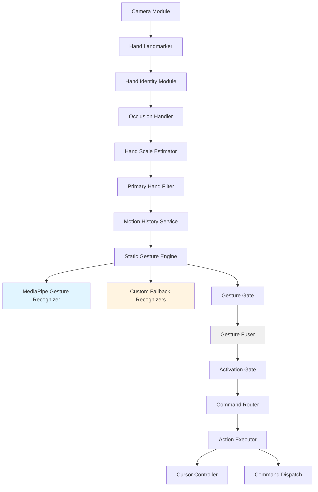

# Product Requirements Document — GestureOS

**Version:** 2.0.0 — AI-First Modular Architecture
**Document Status:** Approved
**Product Name:** GestureOS
**Classification:** Desktop Application / Computer Vision / On-Device ML
**Revision Date:** July 2026
**Source of Truth:** Architecture Freeze Specification v1.0 (2026-07-04)

> This document supersedes PRD v1.3. V1.3 added Multi-Signal Recognition and Conflict Resolution under a fully rule-based paradigm; V2.0 transitions static recognition to Google's MediaPipe Gesture Recognizer (with custom geometric fallback for the gestures MediaPipe does not cover), and introduces a modular pipeline with clear V1/V2 separation. V1.3 user stories, requirements, and acceptance criteria are retained unless explicitly revised below.

---

## Table of Contents

1. [Executive Summary](#1-executive-summary)
2. [Product Vision](#2-product-vision)
3. [Version Scope (V1 vs V2)](#3-version-scope-v1-vs-v2)
4. [User Stories](#4-user-stories)
5. [Gesture Recognition Strategy](#5-gesture-recognition-strategy)
6. [Scale-Invariant Recognition Requirements](#6-scale-invariant-recognition-requirements)
7. [Activation Mode](#7-activation-mode)
8. [Functional Requirements](#8-functional-requirements)
9. [Technical Architecture](#9-technical-architecture)
10. [Component Responsibilities](#10-component-responsibilities)
11. [Runtime State Flow](#11-runtime-state-flow)
12. [Storage Design](#12-storage-design)
13. [Debugging & Diagnostics](#13-debugging--diagnostics)
14. [Recommended Project Structure](#14-recommended-project-structure)
15. [Development Checkpoints](#15-development-checkpoints)
16. [Calibration Requirement](#16-calibration-requirement)
17. [Performance Budgets](#17-performance-budgets)
18. [Testing Plan](#18-testing-plan)
19. [Risks & Challenges](#19-risks--challenges)
20. [Engineering Risks & Mitigation Matrix](#20-engineering-risks--mitigation-matrix)
21. [Deployment Requirements](#21-deployment-requirements)
22. [Success Metrics & Acceptance Criteria](#22-success-metrics--acceptance-criteria)
23. [UI Requirements](#23-ui-requirements)

---

## 1. Executive Summary

GestureOS is a real-time gesture recognition system that enables users to control their Windows computer entirely through hand gestures captured via a standard webcam. It operates as an intelligent operating layer sitting between the user and the OS, translating natural hand movements into precise, context-aware system commands.

> **Core Mission:** Eliminate the dependency on physical input devices by providing a fast, accurate, and extensible touchless interaction layer for desktop operating systems — using Google's MediaPipe for hand landmark and gesture recognition, supplemented by lightweight custom recognizers, with full local processing, and recognition that remains reliable regardless of the user's distance from the camera.

### 1.1 Key Highlights

- Real-time hand tracking at 25+ FPS with sub-100ms detection latency
- AI-assisted recognition: 8 static gestures using MediaPipe Gesture Recognizer (5 covered) + custom fallback (3: Pinch, Three Fingers, OK Sign)
- **Scale-invariant recognition** for all custom fallback gestures (v2.0 inherits from v1.2)
- Activation Mode prevents accidental triggers during natural hand movement
- Persistent hand identity tracking — hands maintain roles even when they cross
- Gesture Gate combining stability hold and cooldown to prevent flicker and double-triggers
- Cursor smoothing via configurable filtering
- Context-aware gesture mapping adapting to the active application
- Multi-profile support: Presentation, Productivity, Gaming, Accessibility
- Full local processing — zero cloud dependency, all ML inference on-device
- Modular, extensible architecture via code-level Extension Registry

### 1.2 Target Platforms

> **Platform Scope (v2.0):** GestureOS V1 targets Windows 10/11 only. macOS and Linux support are part of the V2 expansion scope, with their adapter/executor interfaces defined as V1 ABCs for future implementation.

**V1 Release Target:**

| Windows 10/11 | Python 3.11+ |
|---|---|

**V2 Expansion:**

| macOS 12+ | Ubuntu 20.04+ |
|---|---|

---

## 2. Product Vision

### 2.1 Vision Statement

To redefine human-computer interaction by making touchless, gesture-based control as natural, reliable, and productive as traditional keyboard-and-mouse input — accessible to everyone, regardless of their distance from the camera or their environment's lighting conditions.

### 2.2 Problem Statement

Traditional input devices impose physical and ergonomic constraints on users. This creates barriers for:

- Users with motor impairments or repetitive strain injuries
- Presenters who need slide control without returning to a laptop
- Professionals operating in sterile or cleanroom environments
- Streamers and content creators requiring hands-free interaction
- Individuals seeking more intuitive HCI paradigms

### 2.3 Solution Overview

GestureOS V1 uses MediaPipe Hands for landmark detection and Google's MediaPipe Gesture Recognizer for primary static gesture classification. Three gestures that MediaPipe does not natively cover (Pinch, Three Fingers, OK Sign) are handled by lightweight custom geometric recognizers operating on the same MediaPipe landmarks. All processing is local. Recognition is **scale-invariant** for the custom fallback path: it does not depend on raw pixel measurements that change as the user moves closer to or farther from the camera.

### 2.3.1 Intended Use and Known Limitation (Gorilla Arm)

> **Retained from v1.3:** GestureOS is intended for short and medium-duration interaction and is not intended to fully replace mouse and keyboard usage. Extended, continuous arm-raised gesture use is physically tiring (the "Gorilla Arm" effect) and is not the product's primary design target. GestureOS is positioned as a complementary, situational input method — for presentation control, hands-free media control, accessibility scenarios, and similar short-to-medium-duration interactions.

### 2.4 Value Proposition

| Value Driver | Description |
|---|---|
| Hands-Free Control | Complete OS interaction without touching physical peripherals |
| Accessibility | Enables users with limited mobility to interact naturally |
| Safe Activation Mode | Gestures are ignored unless the user explicitly activates tracking |
| Distance-Independent | Works the same whether the user sits close or stands far from the camera |
| Presentation Control | Advance slides and control media from across the room |
| Productivity | Execute complex shortcuts with single intuitive gestures |
| Privacy-First | All processing is local — no cloud upload, no data collection |
| AI-Assisted Recognition | Google MediaPipe gesture model for accuracy and robustness |
| Modular Architecture | Code-level extension points via ExtensionRegistry |

---

## 3. Version Scope (V1 vs V2)

### 3.1 V1 Scope (Current Implementation)

**In scope:**

| Capability | Component |
|---|---|
| Webcam capture | Camera Module |
| 21-landmark hand tracking | Hand Landmarker (MediaPipe) |
| Per-frame static gesture classification | Static Gesture Engine (MediaPipe Gesture Recognizer + 3 custom fallbacks) |
| Temporal hold & cooldown | Gesture Gate |
| Multi-signal fusion (pass-through in V1) | Gesture Fuser |
| Context-aware command dispatch | Command Router + Context Engine |
| OS-level action execution | Action Executor |
| Activation Mode | Activation Gate |
| Cursor control, mouse clicks, keyboard, system commands | Action Executor subsystems |
| On-device ML model lifecycle | ModelManager |
| Code-level extension points | ExtensionRegistry |
| Windows 10/11 packaging | PyInstaller |

**Out of scope (V2):**

- Dynamic gesture recognition (Wave, Swipe, Circular Motion)
- Custom user-trainable gestures
- Hot-loadable plugin system
- macOS / Linux platforms
- Additional input modalities
- Non-MediaPipe vision backends
- On-device model training

### 3.2 V2 Scope (Future)

V2 extends the architecture with:

| Capability | Approach |
|---|---|
| Dynamic Gesture Engine | Lightweight temporal model (LSTM, GRU, or 1D CNN) on MediaPipe landmark sequences. Final model selection via V2 benchmarking. |
| Gesture Fuser (full) | Fuses static + dynamic candidates with confidence weighting |
| Custom gesture support | Gesture recorder + trainer for user-defined gestures |
| Hot-loadable plugins | Filesystem discovery, version negotiation, sandboxed loading |
| Cross-platform | macOS and Linux adapters/executors |

> **Explicit rejection for V2:** Image-based vision architectures (ViT, raw-pixel CNNs) are not approved for V2 dynamic recognition. V2 must operate on the already-available 63-dimensional MediaPipe landmark features, not on raw pixel data.

---

## 4. User Stories

### 4.1 Primary User Personas

**Persona A — The Presenter (Maya, 34, Marketing Manager)**
Maya delivers weekly client presentations and needs to control her deck from across the room. She activates GestureOS with an Open Palm hold, swipes to advance slides, and deactivates when fielding questions. Her gestures must work the same near or far from the camera.

**Persona B — The Accessibility User (Rajan, 45, Software Architect)**
Rajan suffers from repetitive strain injury. He uses GestureOS as his primary pointing device, relying on index-finger cursor tracking and pinch-to-click.

**Persona C — The Developer/Enthusiast (Priya, 22, CS Student)**
Priya wants to explore gesture-based HCI. She configures GestureOS shortcuts for her coding workflow and uses the debug overlay to understand landmark geometry.

### 4.2 User Stories

| ID | As a... | I want to... | Priority |
|---|---|---|---|
| US-01 | Presenter | control my slides with hand swipes so I can stay away from my laptop | P0 |
| US-02 | Accessibility user | move the cursor with my index finger so I can avoid using a mouse | P0 |
| US-03 | Any user | activate gesture tracking intentionally so accidental movements are ignored | P0 |
| US-04 | Any user | receive visual feedback of detected gestures so I know when gestures are triggered | P0 |
| US-05 | Any user | configure gesture sensitivity so I can reduce accidental triggers | P0 |
| US-06 | Educator | pause and resume video playback with an open palm | P1 |
| US-07 | Developer | see landmark IDs, angles, and normalized distances on screen so I can tune gesture rules | P1 |
| US-08 | Power user | export and import gesture profiles across machines | P1 |
| US-09 | Any user | launch applications with gestures so I can access tools faster | P1 |
| US-10 | Any user | assign different roles to left and right hands independently | P2 |
| US-11 | Presenter (far from camera) | have my gestures recognized the same way whether I'm close to or far from the camera | P0 |
| US-12 | Any user | have a smooth, non-jittery cursor instead of one that shakes | P0 |
| US-13 | Any user | run a calibration wizard so the system adapts to my camera position and space | P1 |
| US-14 | Any user | be warned if my lighting or camera quality is too poor for reliable tracking | P1 |
| US-15 | Multi-hand user | designate a primary/dominant hand so extra hands in frame don't interfere | P2 |
| US-16 | Any user | have the system fall back gracefully if the AI gesture model is unavailable | P0 |
| US-17 | Developer | register custom gesture recognition logic via documented extension interfaces | P2 |

---

## 5. Gesture Recognition Strategy

> **Recognition Philosophy (V2.0):** GestureOS V1 uses Google's MediaPipe Gesture Recognizer as the primary recognition engine, supplemented by approved custom geometric fallback recognizers for the gestures MediaPipe does not cover. All custom fallback recognition is deterministic, scale-invariant, and operates on the same MediaPipe landmarks the primary model uses. No additional ML model is permitted in V1.

### 5.1 MediaPipe Gesture Recognizer Coverage

| GestureOS Gesture | MediaPipe Coverage | Implementation Path |
|---|---|---|
| Open Palm | ✅ Yes (OPEN_PALM) | MediaPipe |
| Closed Fist | ✅ Yes (CLOSED_FIST) | MediaPipe |
| Thumbs Up | ✅ Yes (THUMB_UP) | MediaPipe |
| Thumbs Down | ✅ Yes (THUMB_DOWN) | MediaPipe |
| Peace Sign | ✅ Yes (VICTORY) | MediaPipe |
| Pinch | ❌ No | Custom fallback (geometric) |
| Three Fingers | ❌ No | Custom fallback (geometric) |
| OK Sign | ❌ No | Custom fallback (geometric) |

### 5.2 Custom Fallback Recognizers

The three custom fallback recognizers (Pinch, Three Fingers, OK Sign) operate on normalized MediaPipe landmarks using the same scale-invariant geometric rules established in v1.2. They are invoked only when the Static Gesture Engine determines the MediaPipe result is unavailable or low-confidence.

**Multi-signal discipline (FR-MS-01, retained):** Every custom fallback recognizer must combine multiple independent geometric features. MediaPipe model results are trusted on their own confidence.

### 5.3 V2 Dynamic Gestures (Forward Reference)

Dynamic gestures (Swipe Right/Left/Up/Down, Wave, Circular Motion) are V2 scope. V2 will introduce a Dynamic Gesture Engine using a lightweight temporal classifier on MediaPipe landmark sequences.

| V2 Candidate Architecture | Status |
|---|---|
| LSTM on 63-dim landmark features | Candidate |
| GRU on 63-dim landmark features | Candidate |
| 1D CNN on landmark sequences | Candidate |
| ViT on raw images | **Not approved** (CPU-unfriendly) |

Final model selection occurs during V2 implementation after benchmarking.

---

## 6. Scale-Invariant Recognition Requirements

> Retained from PRD v1.2. Applies to the three custom fallback recognizers (Pinch, Three Fingers, OK Sign). MediaPipe model results are inherently scale-invariant within MediaPipe's training distribution.

### 6.1 Recognition Priority Order

For custom fallback recognizers, the following priority order applies:

1. **Finger State Logic** — Boolean EXTENDED/CURLED per finger (inherently scale-invariant)
2. **Finger & Joint Angles** — Angles formed between adjacent bone segments (inherently scale-invariant)
3. **Normalized Distances** — Distance ratios relative to hand-scale reference
4. **Motion Trajectories** (V2 only) — Normalized by hand scale

### 6.2 Rule: Avoid Raw Pixel Thresholds

Custom fallback recognizers must NOT compare a landmark distance directly against a fixed pixel or fixed frame-normalized-coordinate threshold without first dividing by a hand-scale reference (Section 9 component: Hand Scale Estimator).

### 6.3 Hand Scale Estimation

The Hand Scale Estimator (an analysis-layer component, unchanged from v1.2) computes palm width and height every frame and provides a smoothed scale reference for the custom fallback recognizers.

---

## 7. Activation Mode

> Retained from PRD v1.2/v1.3. Mandatory for V1 release.

### 7.1 Activation State Machine

GestureOS has two tracking states: **INACTIVE** and **ACTIVE**. Gesture recognition and action dispatch are suppressed in INACTIVE state. The overlay still shows hand landmarks in INACTIVE state.

### 7.2 Activation Methods

| Method | Trigger | Notes |
|---|---|---|
| Open Palm Hold | Open Palm held for 1.0 second (configurable) | Primary method |
| Keyboard Shortcut | Ctrl + Alt + G (configurable) | Useful when hands are on keyboard |
| System Tray Toggle | Click tray icon → Toggle Tracking | Accessible at any time |
| Closed Fist Hold | Closed Fist held for 1.5 seconds (configurable, off by default) | Alternative toggle |

### 7.3 Activation Requirements

- **FR-AM-01:** Gesture processing pipeline must be fully bypassed when state is INACTIVE
- **FR-AM-02:** Hand landmark rendering in the overlay must continue in INACTIVE state
- **FR-AM-03:** Activation state must persist across context switches
- **FR-AM-04:** State change must be logged with timestamp
- **FR-AM-05:** Visual indicator must clearly distinguish ACTIVE vs INACTIVE state in overlay
- **FR-AM-06:** Default state on app launch is INACTIVE
- **FR-AM-07:** Hold duration for Open Palm activation is configurable (0.5s – 3.0s)

---

## 8. Functional Requirements

### 8.1 Hand Tracking System

- **FR-HT-01:** System must support USB and built-in webcam input via OpenCV VideoCapture
- **FR-HT-02:** System must detect one or two hands simultaneously within each frame
- **FR-HT-03:** System must extract 21 3D landmarks per detected hand using MediaPipe Hand Landmarker
- **FR-HT-04:** System must provide per-hand confidence scores (0.0–1.0)
- **FR-HT-05:** System must identify hand chirality (left/right) per MediaPipe output
- **FR-HT-06:** System must handle hand occlusion gracefully (Section 8.1.2)
- **FR-HT-07:** All landmark coordinates must be normalized (0.0–1.0) within the webcam frame

#### 8.1.1 Hand Identity Tracking

Persistent role ID (HAND_A, HAND_B) per hand on first detection, preserved across 2-second re-identification window.

#### 8.1.2 Temporary Occlusion Handling

If hand-detection confidence drops below the detection threshold, the system retains the hand's last-known state for up to 300ms (configurable).

#### 8.1.3 Primary Hand Selection

Settings expose a "Dominant Hand Mode" toggle: Off / Left Primary / Right Primary.

### 8.2 Gesture Gate (Stability + Cooldown)

> **New in V2.0:** Stability and Cooldown are unified in a single Gesture Gate component (merging the former StabilityFilter and CooldownFilter).

- **FR-GG-01:** Every static gesture must remain the highest-confidence match for a continuous stability window (default 200ms, configurable 100–500ms) before being passed downstream
- **FR-GG-02:** If the gesture changes or disappears before the stability window elapses, the partial hold is discarded
- **FR-GG-03:** The stability window is tracked independently per hand role (HAND_A / HAND_B)
- **FR-GG-04:** Dynamic gestures (V2) are exempt from the stability window
- **FR-GG-05:** Every gesture type has a configurable cooldown period (default 500ms static, 1000ms dynamic in V2)
- **FR-GG-06:** Cooldown is tracked per (hand_role, gesture_name) pair

### 8.3 Cursor Control Module

- **FR-CC-01:** Index fingertip (landmark 8) position controls cursor by default
- **FR-CC-02:** Hand coordinate space must map to full screen resolution via configurable edge buffers
- **FR-CC-03:** Cursor movement must be smoothed (Exponential Moving Average default; Moving Average, One Euro Filter alternatives)
- **FR-CC-04:** Sensitivity multiplier adjustable (0.1x – 5.0x, default 1.5x)
- **FR-CC-05:** Screen edge clamping must prevent cursor leaving display bounds
- **FR-CC-06:** Calibration mode lets user define active tracking zone
- **FR-CC-07:** Multi-monitor support with per-display coordinate mapping

### 8.4 Motion History Service

> **New in V2.0:** The Motion History Service is a first-class component shared by the Static and (V2) Dynamic Gesture Engines. It maintains a rolling per-hand temporal window of landmark positions.

- **FR-MH-01:** System must store the previous N frames of landmark data per hand role, where N is configurable (default 30 frames ≈ 1 second at 30 FPS)
- **FR-MH-02:** Buffer is implemented as a fixed-capacity rolling structure
- **FR-MH-03:** Buffer entries store raw (unnormalized) landmark data; normalization happens at read time

### 8.5 System Command Engine

| Command Type | Supported Commands | Implementation |
|---|---|---|
| Mouse Control | Left/right/double click, drag-and-drop, scroll | PyAutoGUI / pynput |
| Keyboard Shortcuts | Enter, Escape, Tab, Alt+Tab, Ctrl+C/V/Z/S | pynput |
| Volume Control | Volume up/down, mute toggle | pynput + Windows APIs |
| System Actions | Screenshot, lock screen, show desktop | Windows APIs |

### 8.6 Context-Aware Action Engine

- **FR-CA-01:** System queries the active foreground window title and process name every 250ms
- **FR-CA-02:** Context uses process-name pattern matching
- **FR-CA-03:** Context switch takes effect within one frame of application focus change, subject to the Context Verification Layer

#### 8.6.1 Context Verification Layer

A newly detected foreground window must hold focus continuously for at least 200ms (configurable) before ContextEngine accepts it as the new resolved context.

### 8.7 Gesture Mapping Manager

- **FR-GM-01:** GUI for mapping any gesture to any system command
- **FR-GM-02:** Mappings stored in mappings.json — gesture_name, context, action_type, action_params
- **FR-GM-03:** Conflict detection warns when two mappings share the same gesture in the same context
- **FR-GM-04:** Export produces a portable .json file importable on any supported system
- **FR-GM-05:** Recommend maximum 8–12 active gesture mappings per profile

### 8.8 User Profiles

| Profile | Optimized Gesture Set |
|---|---|
| Presentation Mode | Open Palm to pause, etc. |
| Productivity Mode | Shortcuts for copy/paste/undo |
| Accessibility Mode | Simplified set, large tolerance zones |
| Gaming Mode | Directional swipes, configurable combos |

### 8.9 Visual Feedback System

- **FR-VF-01:** Hand skeleton rendered as overlay on webcam preview
- **FR-VF-02:** Detected gesture name shown with confidence percentage
- **FR-VF-03:** Triggered action badge flashes for 500ms then fades out
- **FR-VF-04:** FPS counter, active profile, active context, and tracking state visible
- **FR-VF-05:** Overlay toggleable via keyboard shortcut
- **FR-VF-06:** ACTIVE state indicator shown in green; INACTIVE in grey
- **FR-VF-07:** Lighting and camera quality warnings shown in overlay
- **FR-VF-08 (new in V2.0):** Fallback mode indicator shown when MediaPipe model is unavailable and the Static Gesture Engine is operating in custom-fallback-only mode

### 8.10 Camera Validation System

At startup, check camera availability, FPS capability, resolution. During operation, surface sustained-low-FPS warnings.

### 8.11 Lighting Quality Detection

Monitor frame brightness correlated with MediaPipe hand-detection confidence; surface sustained low-light warnings.

### 8.12 ML Model Graceful Degradation (New in V2.0)

- **FR-ML-01:** If MediaPipe Gesture Recognizer fails to load at startup, the Static Gesture Engine must switch to custom-fallback-only mode
- **FR-ML-02:** A user-visible indicator must appear in the overlay when the system is in fallback-only mode
- **FR-ML-03:** Auto-reload of the model is attempted once on inference failure; if reload fails, fallback-only mode is engaged
- **FR-ML-04:** All ML model lifecycle events are logged through the DiagnosticsManager

---

## 9. Technical Architecture

### 9.1 V1 Pipeline (Authoritative)

```
Camera Module
  → Hand Landmarker (MediaPipe, 21 landmarks)
  → Hand Identity Module
  → Occlusion Handler
  → Hand Scale Estimator
  → Primary Hand Filter
  → Motion History Service
  → Static Gesture Engine
       ├── MediaPipe Gesture Recognizer (primary)
       └── Custom Fallback Recognizers (Pinch, Three Fingers, OK Sign)
  → Gesture Gate (Stability + Cooldown)
  → Gesture Fuser (pass-through in V1)
  → Activation Gate
  → Command Router
  → Action Executor
       ├── Cursor Controller
       └── Command Dispatch (mouse, keyboard, system)
```

### 9.2 V2 Pipeline (Forward Reference)

```
... (same as V1 through Motion History Service)
  → Static Gesture Engine
  → Dynamic Gesture Engine (V2 only)  ← NEW
  → Gesture Fuser (V2 full fusion)    ← UPGRADED
  → Activation Gate
  → Command Router
  → Action Executor
```

### 9.3 High-Level Architecture Diagram



### 9.4 Cross-Cutting Services

| Service | Responsibility |
|---|---|
| ModelManager | Owns all ML model handles (load, cache, reload, unload) |
| ExtensionRegistry | Registers and queries extension point implementations |
| ContextEngine | Active window detection with verification layer |
| DiagnosticsManager | Structured logging and event taxonomy |
| SettingsManager | Typed settings persistence with per-field validation |
| Logging | Python logging module with structured format |

### 9.5 Technology Stack

| Layer | Technology | Rationale |
|---|---|---|
| Language | Python 3.11+ | Ecosystem breadth for CV and ML |
| Computer Vision | OpenCV 4.8+ | Frame capture, preprocessing |
| Hand Tracking | MediaPipe Hand Landmarker | 21-landmark extraction, CPU-efficient |
| Gesture Recognition | MediaPipe Gesture Recognizer | Google's pre-trained gesture model |
| OS Automation | PyAutoGUI + pynput | Mouse/keyboard control |
| GUI Framework | PyQt6 | Native widgets, overlay, tray |
| Config Storage | JSON files | Human-readable, portable |
| Logging | Python logging module | Structured output |
| Build System | PyInstaller | Single-folder executable |

---

## 10. Component Responsibilities

| Component | Responsibility | V1/V2 |
|---|---|---|
| Camera Module | Webcam frame capture, preprocessing, device reconnect | V1 |
| Hand Landmarker | MediaPipe inference, 21-landmark extraction, chirality | V1 |
| Hand Identity Module | Persistent HAND_A/HAND_B role assignment | V1 |
| Occlusion Handler | 300ms retention of last-known hand state | V1 |
| Hand Scale Estimator | Palm width/height, smoothed scale reference | V1 |
| Primary Hand Filter | Dominant Hand Mode filtering | V1 |
| Motion History Service | Rolling temporal window of landmark data | V1 |
| Static Gesture Engine | MediaPipe Recognizer + 3 custom fallbacks | V1 |
| Dynamic Gesture Engine | Lightweight temporal model on landmark sequences | V2 |
| Gesture Gate | Stability hold + cooldown filtering | V1 |
| Gesture Fuser | Fuse static + dynamic results | V1 (pass-through) / V2 (full) |
| Activation Gate | INACTIVE/ACTIVE state machine | V1 |
| Command Router | Context resolution + action mapping + routing | V1 |
| Action Executor | OS-level dispatch (cursor, click, keyboard, system) | V1 |
| Context Engine | Active window detection with verification | V1 |
| ModelManager | ML model lifecycle (load, cache, reload, unload) | V1 |
| ExtensionRegistry | Extension point registration and discovery | V1 |
| DiagnosticsManager | Structured logging | V1 |
| SettingsManager | Typed settings persistence | V1 |

---

## 11. Runtime State Flow

| Stage | Description / Output | Error Behavior |
|---|---|---|
| 1. Frame Captured | OpenCV reads a BGR frame | Camera unavailable: emit CameraError, retry |
| 2. Frame Processed | Flip, resize, BGR→RGB | Frame is None: skip frame |
| 3. Hand Detected | MediaPipe returns 21 landmarks per hand | No hands: clear trajectory buffers |
| 4. Identity Assigned | HAND_A/HAND_B roles assigned | Ambiguous: log warning, chirality fallback |
| 5. Occlusion Bridged | Last-known state retained if hand missing | Window expired: release to re-identification |
| 6. Scale Estimated | Palm width/height computed and smoothed | Cannot compute: skip gesture eval this frame |
| 7. Primary Hand Filtered | Dominant Hand Mode applied | N/A — pass-through if disabled |
| 8. Motion History Updated | Temporal window updated per hand role | N/A — always updates |
| 9. Gesture Classified | Static Gesture Engine emits candidates | Low confidence: invoke custom fallbacks |
| 10. Gate Filtered | Stability + cooldown filtering | Below thresholds: discard |
| 11. Fused | Single gesture per hand (V1 pass-through) | No candidates: emit None |
| 12. Activation Checked | INACTIVE → render only; ACTIVE → continue | N/A |
| 13. Context Resolved | Active window with 200ms verification | OS query fails: use last known |
| 14. Action Mapped | (gesture, context) → action lookup | No mapping: log info, no action |
| 15. Action Executed | ActionExecutor dispatches OS input event | Dispatch fails: log error, continue |

---

## 12. Storage Design

> Retained from PRD v1.2.

### 12.1 File Layout

```
~/.gestureos/
├── settings.json
├── profiles.json
├── mappings/
│   ├── default.json
│   ├── presentation.json
│   ├── productivity.json
│   └── <profile_name>.json
└── logs/
    ├── gestureos.log
    └── diagnostics.log
```

### 12.2 settings.json Schema (V2.0)

```json
{
  "camera_index": 0,
  "target_fps": 30,
  "gesture_confidence_threshold": 0.85,
  "activation_hold_duration_s": 1.0,
  "cursor_smoothing_method": "exponential",
  "cursor_smoothing_alpha": 0.7,
  "cursor_speed_multiplier": 1.5,
  "gesture_cooldown_static_ms": 500,
  "gesture_cooldown_dynamic_ms": 1000,
  "gesture_stability_window_ms": 200,
  "motion_history_frames": 30,
  "occlusion_retention_ms": 300,
  "context_verification_ms": 200,
  "dominant_hand_mode": "off",
  "active_profile": "productivity",
  "show_overlay": true,
  "developer_mode": false,
  "ml_model_path": "models/gesture_recognizer.task"
}
```

---

## 13. Debugging & Diagnostics

### 13.1 Logging System

Log events across these categories:

- Camera Events (startup, disconnect, FPS/resolution validation)
- Tracking Events (hand detected/lost, occlusion, scale)
- Gesture Events (candidate detected, gate passed/failed, fused, triggered)
- Context Events (resolved, verification held/rejected)
- Action Events (executed, failed)
- ML Events (model loaded, model fallback activated, inference timeout)
- Errors / Warnings

### 13.2 Developer Mode

When enabled, display:

- Landmark IDs and coordinates
- Finger states and angles
- Normalized distances (custom fallback gestures)
- Hand scale estimate
- Confidence scores (both MediaPipe and custom fallback)
- Cooldown timers
- Gesture stability timer progress
- Gesture Fuser state
- ML model status (loaded / fallback-only)

### 13.3 Debug Overlay

Display: FPS, active profile/context, gesture name + confidence, tracking state, quality warnings, fallback mode indicator.

---

## 14. Recommended Project Structure

```
gestureos/
├── main.py
├── app/
│   ├── core.py
│   └── capture_thread.py
├── camera/
├── tracking/
│   ├── hand_landmarker.py        (renamed from hand_detector.py)
│   ├── hand_identity.py
│   ├── occlusion_handler.py
│   ├── hand_scale.py
│   └── primary_hand_filter.py
├── gestures/
│   ├── static_gesture_engine.py  (merged: MediaPipe + 3 fallbacks)
│   ├── dynamic_gesture_engine.py (V2 stub in V1)
│   ├── motion_history_service.py (renamed, elevated)
│   ├── gesture_gate.py           (merged: stability + cooldown)
│   ├── gesture_fuser.py          (renamed from conflict_resolver.py)
│   ├── activation_gate.py
│   └── gesture_utils.py
├── context/
├── actions/
│   ├── command_router.py
│   ├── action_executor.py        (absorbed cursor_controller)
│   └── executors/
│       ├── base.py
│       └── windows_executor.py
├── models/
│   └── model_manager.py          (new in V2.0)
├── ext/
│   ├── base.py                   (new in V2.0)
│   └── registry.py               (new in V2.0)
├── profiles/
├── calibration/
├── overlay/
├── settings/
├── diagnostics/
├── ui/
├── tests/
└── assets/
```

> Folder-by-folder responsibilities are detailed exhaustively in the companion TRD v2.0.

---

## 15. Development Checkpoints

> Checkpoint structure is restructured in Implementation Plan v2.0. The checkpoint cross-reference table in that document maps engineering checkpoints to V1 deliverables.

| Checkpoint | Focus | Key Deliverables |
|---|---|---|
| CP-1 | Core Hand Tracking | Camera module, Hand Landmarker, MediaPipe model integration, overlay, ModelManager |
| CP-2 | Hand Analysis Layer | Identity, occlusion, scale, primary hand, Motion History Service |
| CP-3 | Static Gesture Engine | MediaPipe Recognizer wiring, 3 custom fallbacks, Gesture Gate, Gesture Fuser |
| CP-4 | Activation & Command Routing | Activation Gate, Command Router, Context Engine wiring |
| CP-5 | Action Execution | ActionExecutor (cursor + dispatch), WindowsExecutor |
| CP-6 | GUI & Calibration | Settings, Profiles, Calibration Wizard, ExtensionRegistry integration |
| CP-7 | Diagnostics & Developer Mode | Full debug overlay, ML status indicators |
| CP-8 | Testing & Optimization | Full test pyramid, performance validation |
| CP-9 | Packaging & Release | PyInstaller, Windows installer, documentation |

### 15.1 Checkpoint Acceptance Criteria (V2.0 Additions)

**CP-1 additions:**
- MediaPipe Gesture Recognizer model loads successfully and inference runs within per-frame budget
- ModelManager handles model load failure with automatic fallback activation

**CP-3 additions:**
- 8 static gestures recognized (5 via MediaPipe, 3 via custom fallback)
- Gesture Gate correctly applies stability + cooldown
- Gesture Fuser pass-through verified

**CP-7 additions:**
- Fallback mode indicator appears in overlay when MediaPipe model is unavailable
- Developer Mode panel shows ML model status

---

## 16. Calibration Requirement

> Retained from PRD v1.2.

| Step | Purpose | User Action |
|---|---|---|
| Camera Position | Confirm the camera can see the user's full gesture range | User waves hand across intended gesture area |
| Sensitivity | Tune gesture confidence threshold | User performs each static gesture |
| Cursor Speed | Tune cursor_speed_multiplier | User adjusts a slider while moving hand |
| Tracking Area | Define the active screen-mapping zone | User marks corners of intended gesture zone |

- **FR-CAL-01:** Calibration wizard is offered during first-run onboarding and re-accessible from Settings
- **FR-CAL-02:** Calibration results are persisted to settings.json immediately upon completion
- **FR-CAL-03:** Skipping calibration is allowed — system falls back to documented defaults
- **FR-CAL-04:** Calibration wizard must complete in under 3 minutes

---

## 17. Performance Budgets

> Retained from PRD v1.3.

### 17.1 Reference Hardware Baseline

| Component | Specification |
|---|---|
| CPU | Intel Core i5, 8th Generation, or equivalent |
| RAM | 8 GB |
| Camera | 720p webcam |
| Target | 25+ FPS sustained |

### 17.2 Performance Targets

| Metric | Target |
|---|---|
| FPS | ≥ 25 |
| Detection Latency | < 100 ms |
| End-to-End Action Latency | < 150 ms |
| CPU Usage | < 20% (single core average) |
| Memory Usage | < 300 MB |

---

## 18. Testing Plan

### 18.1 Unit Testing

- Framework: pytest
- Coverage target: ≥ 80% line coverage
- All tests use mock landmark data — no live webcam required
- Scale-invariance must be explicitly tested for the 3 custom fallback recognizers

### 18.2 Gesture Accuracy Testing

- 100 samples per gesture from 5 different users
- 3 lighting conditions: bright, dim, backlit
- 3 camera distances: close (~30cm), medium (~75cm), far (~150cm)
- Acceptance: ≥ 95% accuracy at every distance

### 18.3 Performance Testing

- 30-minute continuous session
- All Section 17 budgets met simultaneously

### 18.4 Integration Testing

- Full pipeline: gesture input to OS action in < 150ms
- Context switching with rapid Alt-Tab sequences
- Activation gate: no actions fire in INACTIVE state
- ML fallback: system operates correctly when MediaPipe model is unavailable

---

## 19. Risks & Challenges

| Risk | Severity | Impact | Mitigation |
|---|---|---|---|
| MediaPipe Model Unavailability | High | No static gesture recognition possible | Custom fallback for 3 gestures; user-visible warning for the 5 MediaPipe-covered gestures |
| Model Loading Failure at Startup | Medium | System starts in degraded mode | ModelManager auto-fallback; overlay indicator |
| Inference Latency Exceeds Budget | Medium | FPS drops below 25 | Alternating-frame inference strategy (TRD §15) |
| Background Gesture Triggers | High | Natural hand movements fire unintended commands | Activation Mode (Section 7) |
| Multi-Hand Ambiguity | High | Hands cross; system swaps roles | Hand Identity Tracker with proximity re-identification |
| Scale Sensitivity (Custom Fallback) | High | Fallback gestures fail at varying distances | Scale-Invariant Recognition (Section 6) |
| Lighting Variation | High | Poor detection in low light | Lighting Quality Detection |
| User Fatigue (Gorilla Arm) | Medium | Extended arm-raised usage causes fatigue | Short/medium-duration interaction framing |

---

## 20. Engineering Risks & Mitigation Matrix

| Risk | Severity | Mitigation |
|---|---|---|
| Cursor Jitter | High | Cursor Smoothing (EMA default) |
| Gesture Flicker | High | Gesture Gate stability hold |
| Double Trigger | High | Gesture Gate cooldown |
| Scale Sensitivity (Fallback) | High | Normalized distances, finger angles |
| Hand Crossing | Medium | Hand Identity Tracking |
| Lighting Issues | Medium | Lighting Quality Detection |
| Camera Disconnect | Medium | Auto Reconnect |
| Context Errors | Medium | Context Verification Layer |
| CPU Usage | Medium | Performance Budget + alternating-frame inference |
| Model Bundling Failure | High | Early smoke-build; ModelManager error handling |

---

## 21. Deployment Requirements

### 21.1 Packaging

PyInstaller produces a native Windows executable, bundling the Python runtime, MediaPipe model files, and all dependencies. MediaPipe model files must be explicitly bundled via PyInstaller's `datas` directive (TRD §12).

### 21.2 Installer

Windows: Inno Setup-based installer producing `GestureOS_Setup.exe` with Start Menu entry and optional auto-start.

### 21.3 Release Deliverables

- GestureOS.exe (packaged executable)
- Installer
- Documentation (user guide, gesture reference card, calibration walkthrough)
- Default Configurations (factory-default settings.json, profiles.json, mappings/*.json, MediaPipe model file)
- All bundled and copied into ~/.gestureos/ on first launch

### 21.4 Release Acceptance Gate

- All V1 checkpoints meet their acceptance criteria
- Performance Budgets verified on reference hardware
- No P0 bugs open
- Release deliverables confirmed present in build artifact
- ML model fallback path tested and verified

---

## 22. Success Metrics & Acceptance Criteria

### 22.1 Product KPIs

| Metric | Target |
|---|---|
| Gesture Recognition Accuracy | ≥ 95% |
| Scale Invariance | Accuracy stable within 3% across near/medium/far distances |
| End-to-End Latency | < 150 ms |
| Sustained FPS | ≥ 25 |
| CPU Usage | < 20% |
| Memory Usage | < 300 MB |
| False Trigger Rate | < 5% |
| Double-Trigger Rate | 0% |
| Session Crash Rate | < 1 per 8h |
| Activation Misfire Rate | 0% in INACTIVE |
| ML Fallback Availability | 100% (system never crashes due to model failure) |

---

## 23. UI Requirements

### 23.1 Application Windows

**Main Control Panel**
- System tray icon with menu: Open, Toggle Tracking, Switch Profile, Settings, Quit
- Status bar: Active profile, FPS counter, webcam status
- Gesture mapping table
- Quick-toggle switches

**Calibration Wizard**
- Step 1: Camera Position check
- Step 2: Sensitivity tuning
- Step 3: Cursor Speed tuning
- Step 4: Tracking Area definition

**Settings Panel**
- Camera tab: Device selector, resolution, FPS target, camera validation status
- Gesture tab: Confidence threshold, cooldown sliders, stability window slider
- Cursor tab: Speed multiplier, smoothing method, calibration wizard launcher
- ML tab: Model status, fallback mode indicator (new in V2.0)
- Profiles tab: Create, rename, delete, import, export
- About tab: Version, licenses, GitHub link

### 23.2 Visual Overlay

- Semi-transparent overlay window, always on top
- Hand skeleton rendered in green with landmark dots
- Gesture label badge with confidence
- Action badge flashes briefly
- FPS + context label
- Lighting/camera quality warning badge
- **ML fallback mode indicator** (new in V2.0)

---

*End of GestureOS PRD v2.0*
