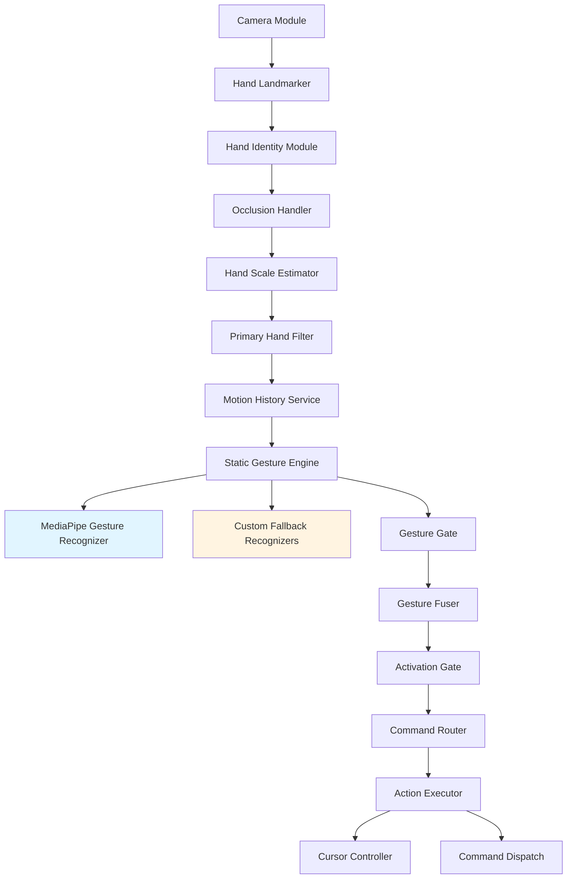
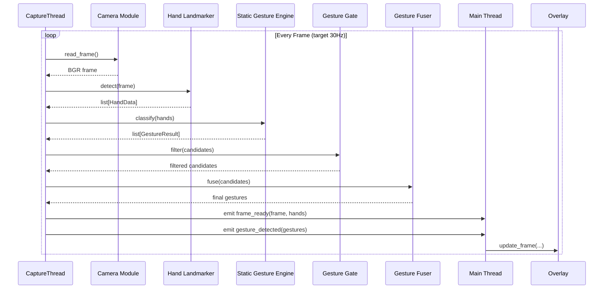
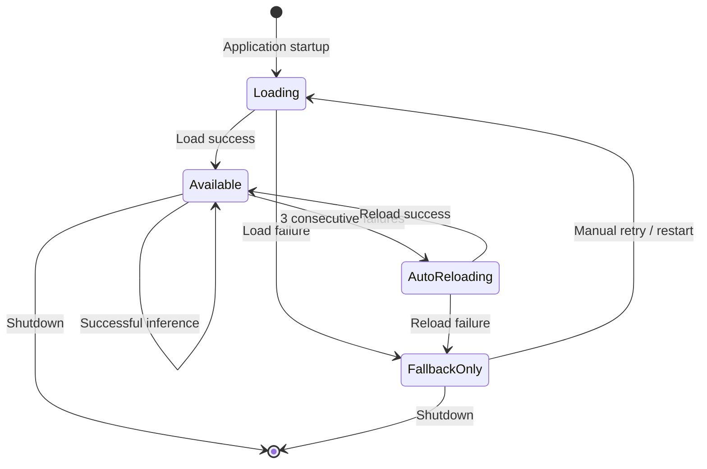
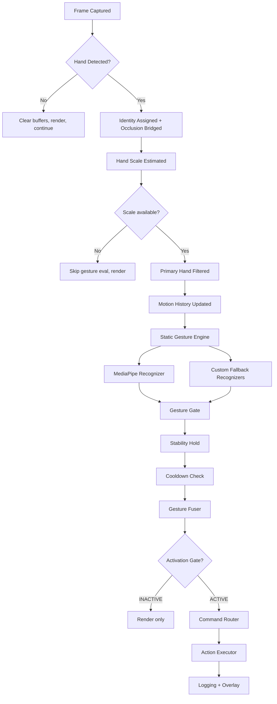

# Technical Requirements Document — GestureOS

**Document Type:** Technical Requirements Document (TRD)
**Source of Truth:** Architecture Freeze Specification v1.0 (2026-07-04)
**Product Source:** GestureOS PRD v2.0
**Version:** 2.0.0
**Audience:** Engineering team, AI coding agents, QA
**Language/Runtime:** Python 3.11+
**Date:** July 2026

> **Document Scope:** This TRD translates GestureOS PRD v2.0 into an implementation blueprint. It defines the V1 architecture: MediaPipe-based static gesture recognition with custom geometric fallback, modular pipeline with cross-cutting services, and code-level extension points. V2 components (Dynamic Gesture Engine, hot-loadable plugins) are documented as forward references and architectural targets, not V1 implementation deliverables.
>
> **Major Changes from TRD v1.2:**
> - Recognition rewritten: MediaPipe Gesture Recognizer is the primary engine; 3 custom geometric fallback recognizers (Pinch, Three Fingers, OK Sign) for the gestures MediaPipe does not cover
> - Pipeline restructured: HandLandmarker (renamed from TrackingModule), StaticGestureEngine (merged from GestureEngine + StaticRecognizer), GestureGate (merged from StabilityFilter + CooldownFilter), GestureFuser (renamed from ConflictResolver), CommandRouter (split from ActionEngine), ActionExecutor (absorbed CursorController)
> - New components: ModelManager (ML model lifecycle), ExtensionRegistry (code-level extension points)
> - MotionHistoryService elevated from deque to first-class service shared by Static and (V2) Dynamic engines
> - V2 Dynamic Gesture Engine specified as a lightweight temporal model (LSTM/GRU/1D-CNN on landmark sequences); ViT/image-based architectures explicitly not approved
> - All RULES.md and PRD cross-references updated to V2.0 component names

---

## Table of Contents

1. [Technical Overview](#1-technical-overview)
2. [System Architecture](#2-system-architecture)
3. [Component Architecture](#3-component-architecture)
4. [Static Gesture Engine Detail](#4-static-gesture-engine-detail)
5. [ModelManager and ML Model Lifecycle](#5-modelmanager-and-ml-model-lifecycle)
6. [Runtime State Flow](#6-runtime-state-flow)
7. [Data Models](#7-data-models)
8. [Configuration Design](#8-configuration-design)
9. [Folder Structure](#9-folder-structure)
10. [Extension System](#10-extension-system)
11. [Diagnostics Architecture](#11-diagnostics-architecture)
12. [Calibration Subsystem](#12-calibration-subsystem)
13. [Cross-Platform Strategy](#13-cross-platform-strategy)
14. [Packaging Strategy](#14-packaging-strategy)
15. [Performance Budget Engineering](#15-performance-budget-engineering)
16. [Technical Risks](#16-technical-risks)
17. [V2 Architecture Preview](#17-v2-architecture-preview)

---

## 1. Technical Overview

GestureOS is implemented as a single-process, multi-threaded Python desktop application. A real-time capture-and-recognition loop runs on a dedicated CaptureThread; a PyQt6 event loop runs on the main thread for UI, overlay, and system tray. The two communicate via thread-safe Qt signals.

### 1.1 Engineering Principles

- **Local-only:** No network calls in the core pipeline. All ML inference runs on-device CPU. All persistence is local JSON files.
- **Fail-soft:** Any single-module failure degrades gracefully. ML model failure → custom-fallback mode. Camera glitch → auto-reconnect. Low light → advisory warning.
- **Separation of concerns:** Capture, analysis, recognition, fusing, routing, and execution are independent modules connected only through well-defined data objects (Section 7).
- **Configuration over code:** Gesture-to-action behavior and all tunable parameters live in JSON, not in source.
- **Modular by design:** Code-level extension points via ExtensionRegistry enable future plugin support without V1 architectural overhead.
- **ML governance:** Only the MediaPipe Gesture Recognizer is permitted in V1. All model lifecycle is owned by ModelManager.

### 1.2 Technology Stack

| Technology | Used For | Why Chosen |
|---|---|---|
| Python 3.11+ | Application runtime | Fast iteration, mature CV/ML ecosystem |
| OpenCV | Camera capture, frame ops | Cross-platform VideoCapture, brightness analysis |
| MediaPipe Hand Landmarker | 21-landmark hand tracking | Pre-trained, CPU-efficient, production-proven |
| MediaPipe Gesture Recognizer | Primary static gesture classification | Google's pre-trained model, covers 5 of 8 static gestures |
| NumPy | Vector math for custom fallback | Vectorized distance/angle calculations |
| PyQt6 | GUI, overlay, system tray, calibration wizard | Native widgets, mature threading model |
| PyAutoGUI | Simple cross-platform OS actions | Single API across OSes |
| pynput | Low-latency key/mouse events | Lower dispatch latency than PyAutoGUI |
| pywin32 | Windows active-window detection | Required for ContextEngine on Windows |
| PyInstaller | Packaging | Single-folder executable |
| pytest | Testing | Supports fixtures for mock landmark data |

---

## 2. System Architecture

### 2.1 V1 High-Level Pipeline



### 2.2 Threading Model

A single background `QThread` (`CaptureThread`) owns the camera loop and runs every pipeline stage synchronously within one frame iteration. The main thread owns PyQt6's event loop, the overlay window, the settings UI, and the calibration wizard. Cross-thread communication uses Qt signals exclusively.



### 2.3 Data Flow Summary

| Stage | Owning Module | Data Object Produced |
|---|---|---|
| Camera | CameraModule | `np.ndarray` (BGR frame) |
| Hand Landmarker | HandLandmarker | `list[HandData]` |
| Identity + Occlusion | HandIdentityModule, OcclusionHandler | `list[HandData]` (role-tagged, gap-bridged) |
| Scale Estimation | HandScaleEstimator | `HandData.scale` populated |
| Primary Hand Filter | PrimaryHandFilter | `list[HandData]` (gesture_eligible set) |
| Motion History | MotionHistoryService | (side-effect: temporal window updated) |
| Static Gesture Engine | StaticGestureEngine | `list[GestureResult]` |
| Gesture Gate | GestureGate | `list[GestureResult]` (stability + cooldown filtered) |
| Gesture Fuser | GestureFuser | `list[GestureResult]` (≤1 per hand, V1 pass-through) |
| Activation Gate | ActivationGate | (state-dependent gate decision) |
| Command Router | CommandRouter | `Action` |
| Action Executor | ActionExecutor | `ActionResult` |

---

## 3. Component Architecture

> **Component Boundary Rule:** A component may only import from its own folder, the shared data-model module, and the extension interfaces (Section 10). It may NOT import PyQt6 widgets, the camera, or another component's internals. Exception: `overlay/` and `ui/`, which are UI-layer and may depend on everything else read-only.

### 3.1 Camera Module *(unchanged)*

Wraps OpenCV's `VideoCapture`. Owns the camera device lifecycle.

- **Responsibilities:** open/configure device; yield BGR frames; detect disconnection and reconnect.
- **Output:** `np.ndarray` shape (H,W,3), BGR, flipped, resized.
- **Dependencies:** `opencv-python` only.

### 3.2 HandLandmarker *(renamed from TrackingModule/HandDetector)*

Wraps MediaPipe Hand Landmarker. Converts raw output into `HandData` objects.

- **Responsibilities:** initialize MediaPipe Hand Landmarker; convert frames to RGB; run inference; build `list[HandData]` with chirality + confidence.
- **Configuration:** `model_complexity=1` (per CP-4+ tracking stabilization), `min_tracking_confidence=0.4`.
- **Output:** `list[HandData]`, length 0–2.
- **Error Handling:** MediaPipe exception → log ERROR, return empty list; malformed hand → discard; persistent failures → auto-reload via `ModelManager`.

```python
class HandLandmarker:
    def __init__(self, model_manager: ModelManager):
        self.model_manager = model_manager
        self.landmarker = model_manager.get_hand_landmarker()
    
    def detect(self, frame: np.ndarray) -> list[HandData]:
        ...
```

### 3.3 HandIdentityModule *(unchanged)*

Maintains persistent hand identity (HAND_A / HAND_B) across frames.

- **Responsibilities:** assign stable roles; match via nearest-neighbor proximity; preserve role for up to 2s after loss.
- **Output:** `list[HandData]` (role populated).

### 3.4 OcclusionHandler *(unchanged)*

Bridges brief tracking interruptions.

- **Responsibilities:** retain last-known `HandData` for up to 300ms (configurable) when detection confidence drops.
- **Output:** `list[HandData]` (real or bridged, with `is_retained` flag).

### 3.5 HandScaleEstimator *(unchanged)*

Computes a smoothed hand-scale reference.

- **Responsibilities:** compute palm width, palm height, bounding box every frame; 5-frame moving average.
- **Output:** populates `HandData.scale: HandScale`.

### 3.6 PrimaryHandFilter *(unchanged)*

Implements Dominant Hand Mode.

- **Responsibilities:** set `gesture_eligible` flag per hand based on chirality match.
- **Output:** `list[HandData]` (gesture_eligible set).

### 3.7 MotionHistoryService *(elevated from MotionHistoryBuffer)*

First-class component shared by Static and (V2) Dynamic engines. Maintains a rolling per-hand temporal window of landmark data.

- **Responsibilities:** store raw (unnormalized) `(x, y, z, timestamp_ms)` tuples per hand role; evict oldest entries at capacity; provide time-windowed queries.
- **Capacity:** 30 frames default (≈1 second at 30 FPS), configurable 10–60.
- **API:**
  - `update(role: str, landmarks: list[tuple], wrist_pos: tuple, now: float) -> None`
  - `get_window(role: str, duration_ms: int) -> list[tuple]`
  - `get_hold_duration(role: str) -> float` (for stability check)
  - `clear(role: str) -> None`
- **Design note:** The Static Engine does NOT use the buffer for gesture classification (MediaPipe handles that per-frame). It uses the buffer for: (a) confirming a gesture was held continuously for 200ms, (b) bridging occlusion gaps. The Dynamic Engine (V2) uses it for trajectory analysis.

```python
class MotionHistoryService:
    def __init__(self, max_frames: int = 30):
        self.buffers: dict[str, deque] = {
            'HAND_A': deque(maxlen=max_frames),
            'HAND_B': deque(maxlen=max_frames),
        }
    
    def update(self, role: str, landmarks: list, wrist_pos: tuple, now: float):
        self.buffers[role].append((wrist_pos[0], wrist_pos[1], wrist_pos[2], now * 1000))
    
    def get_window(self, role: str, duration_ms: int) -> list[tuple]:
        cutoff = time.time() * 1000 - duration_ms
        return [entry for entry in self.buffers[role] if entry[3] >= cutoff]
    
    def clear(self, role: str):
        self.buffers[role].clear()
```

### 3.8 StaticGestureEngine *(merged from GestureEngine + StaticRecognizer)*

**The recognition core for V1.** Two-stage recognition: MediaPipe Gesture Recognizer (primary) + custom geometric fallback (for 3 uncovered gestures).

- **Responsibilities:**
  1. Query MediaPipe Gesture Recognizer via `ModelManager` for each detected hand
  2. Map MediaPipe results to internal gesture names
  3. If MediaPipe returns low confidence or None, invoke the relevant custom fallback recognizer
  4. Emit all qualifying candidates as `GestureResult` objects
- **Output:** `list[GestureResult]` (0–N per hand, N typically ≤2)

#### 3.8.1 MediaPipe-to-Internal Gesture Mapping

| MediaPipe Class | Internal Name | Default Action |
|---|---|---|
| `OPEN_PALM` | `open_palm` | Pause / Stop |
| `CLOSED_FIST` | `fist` | Hold / Drag start |
| `THUMB_UP` | `thumbs_up` | Confirm / Vol Up |
| `THUMB_DOWN` | `thumbs_down` | Cancel / Vol Down |
| `VICTORY` | `peace_sign` | Screenshot |
| `POINTING_UP` | `pointing_up` | (informational) |

#### 3.8.2 Custom Fallback Recognizers

For the 3 gestures MediaPipe does not cover:

| Gesture | Custom Recognizer | Recognition Logic |
|---|---|---|
| Pinch | `detect_pinch()` | `euclidean_distance(thumb_tip, index_tip) / palm_width < 0.35` |
| Three Fingers | `detect_three_fingers()` | Index + Middle + Ring EXTENDED, Pinky + Thumb CURLED |
| OK Sign | `detect_ok_sign()` | Same pinch distance AND Middle/Ring/Pinky EXTENDED |

All custom fallback recognizers:
- Operate on normalized MediaPipe landmarks
- Use shared primitives from `gesture_utils.py` (euclidean_distance, finger_angle, finger_states)
- Apply multi-signal discipline (combine ≥2 independent geometric features)
- Return `None` if hand.scale is None (FR-SC-04)

```python
class StaticGestureEngine:
    def __init__(self, model_manager: ModelManager, settings: Settings):
        self.model_manager = model_manager
        self.settings = settings
        self.fallback_recognizers = {
            'pinch': detect_pinch,
            'three_fingers': detect_three_fingers,
            'ok_sign': detect_ok_sign,
        }
    
    def classify(self, hands: list[HandData]) -> list[GestureResult]:
        candidates = []
        for hand in hands:
            if not hand.gesture_eligible:
                continue
            
            # Stage 1: MediaPipe Gesture Recognizer
            mp_result = self._query_mediapipe(hand)
            if mp_result and mp_result.confidence >= self.settings.gesture_confidence_threshold:
                candidates.append(mp_result)
            
            # Stage 2: Custom fallback (always run, fuser will dedupe by confidence)
            for gesture_name, recognizer in self.fallback_recognizers.items():
                result = recognizer(hand)
                if result and result.confidence >= self.settings.gesture_confidence_threshold:
                    candidates.append(result)
        
        return candidates
    
    def _query_mediapipe(self, hand: HandData) -> GestureResult | None:
        if not self.model_manager.is_gesture_model_available():
            return None
        try:
            return self.model_manager.recognize_gesture(hand.landmarks)
        except Exception as e:
            logger.error(f"MediaPipe inference failed: {e}")
            self.model_manager.record_inference_failure()
            return None
```

### 3.9 GestureGate *(merged from StabilityFilter + CooldownFilter)*

Two-stage temporal gating of gesture candidates.

- **Responsibilities:**
  - **Stage 1 — Stability Hold:** A static gesture must remain the highest-confidence match for 200ms (configurable 100–500ms) before being accepted. Dynamic gestures (V2) are exempt.
  - **Stage 2 — Cooldown:** Per-(role, gesture_name) cooldown timer. Default 500ms static, 1000ms dynamic.
- **Output:** `list[GestureResult]` (filtered)
- **Design note:** Although combined, the two stages remain independently testable classes (`StabilityGate`, `CooldownGate`) behind the `GestureGate` facade.

```python
class GestureGate:
    def __init__(self, settings: Settings):
        self.stability = StabilityGate(
            window_ms=settings.gesture_stability_window_ms,
        )
        self.cooldown = CooldownGate(
            static_ms=settings.gesture_cooldown_static_ms,
            dynamic_ms=settings.gesture_cooldown_dynamic_ms,
        )
    
    def check(self, role: str, candidates: list[GestureResult], now: float) -> list[GestureResult]:
        stable = self.stability.check(role, candidates, now)
        return self.cooldown.check(role, stable, now)
```

### 3.10 GestureFuser *(renamed from ConflictResolver)*

- **V1 behavior:** Strict pass-through. With only one active engine (Static), and GestureGate having already filtered, the fuser returns its input unchanged.
- **V2 behavior:** Will fuse static + dynamic candidates with confidence-based weighting.
- **Output:** `list[GestureResult]` (≤1 per hand)
- **Error Handling:** Never raises; defensive try/except returns input unchanged on internal error.
- **Inputs:** Immutable (RULES §4.7): returns a new list, never mutates input.

```python
class GestureFuser:
    def fuse(self, candidates: list[GestureResult]) -> list[GestureResult]:
        # V1: pass-through
        if not candidates:
            return []
        # Group by hand role, take highest confidence per role
        by_role: dict[str, GestureResult] = {}
        for c in candidates:
            if c.hand_role not in by_role or c.confidence > by_role[c.hand_role].confidence:
                by_role[c.hand_role] = c
        return list(by_role.values())
```

### 3.11 ActivationGate *(unchanged)*

INACTIVE/ACTIVE state machine.

- **Responsibilities:** binary state machine; Open Palm hold-timer; toggle via keyboard shortcut or tray icon.
- **Output:** gates whether Command Router receives gestures.

### 3.12 ContextEngine *(unchanged)*

Determines the active foreground application with Context Verification Layer.

- **Responsibilities:** poll OS every 250ms; require 200ms continuous focus before committing a new context.
- **Dependencies:** `WindowsContextAdapter` (V1 only).

### 3.13 CommandRouter *(split from ActionEngine)*

Converts a recognized gesture into an `Action` for execution.

- **Responsibilities:**
  1. Obtain current context from ContextEngine
  2. Look up `(gesture, context) → action` in active profile's mapping table
  3. Final cooldown re-check
  4. Route to ActionExecutor (one-shot) or CursorController (continuous)
- **Output:** `Action`
- **Dependencies:** ProfileManager, ContextEngine, ActionExecutor.
- **Constraint:** Does NOT call OS APIs directly. Does NOT execute. Only builds and routes.

```python
class CommandRouter:
    def __init__(self, profile_manager: ProfileManager, context_engine: ContextEngine):
        self.profile_manager = profile_manager
        self.context_engine = context_engine
    
    def route(self, gesture: GestureResult) -> Action | None:
        context = self.context_engine.resolve(time.time())
        mapping = self.profile_manager.get_mapping(
            gesture_name=gesture.gesture_name,
            context=context,
        )
        if mapping is None:
            return None
        return Action(
            action_type=mapping['action_type'],
            params=mapping['action_params'],
            gesture_name=gesture.gesture_name,
            context=context,
        )
```

### 3.14 ActionExecutor *(absorbed CursorController)*

All OS-level dispatch.

- **Responsibilities:** cursor movement (via internal CursorController subsystem), mouse clicks, keyboard shortcuts, scroll, volume, brightness, system actions.
- **Subsystems:**
  - `CursorController` (internal): continuous cursor path with smoothing
  - `CommandDispatch` (internal): one-shot action dispatch
- **V1 Implementation:** `WindowsExecutor` is the only concrete implementation.
- **Constraint:** Only module permitted to call OS-level APIs.

### 3.15 ModelManager *(new in V2.0)*

Sole owner of all ML model handles.

- **Responsibilities:**
  - Load MediaPipe Gesture Recognizer at startup
  - Expose model handle(s) to Static Gesture Engine
  - Handle model load failures (set `gesture_model_available=False`)
  - Monitor inference failures, trigger auto-reload after 3 consecutive failures
  - Unload models on shutdown
- **API:**
  - `get_hand_landmarker() -> HandLandmarker`
  - `recognize_gesture(landmarks: list) -> GestureResult | None`
  - `is_gesture_model_available() -> bool`
  - `record_inference_failure() -> None`
  - `reload_gesture_model() -> bool`
- **Design:** Hot-loading/reloading is supported, but only for the single permitted V1 model.

```python
class ModelManager:
    GESTURE_MODEL_PATH = "models/gesture_recognizer.task"
    MAX_CONSECUTIVE_FAILURES = 3
    
    def __init__(self, diagnostics: DiagnosticsManager):
        self.diagnostics = diagnostics
        self._gesture_model = None
        self._consecutive_failures = 0
        self._load_gesture_model()
    
    def _load_gesture_model(self) -> bool:
        try:
            self._gesture_model = mp.tasks.vision.GestureRecognizer.create_from_model_path(
                self.GESTURE_MODEL_PATH
            )
            self.diagnostics.log_ml_event("model_loaded", {"model": "gesture_recognizer"})
            return True
        except Exception as e:
            self.diagnostics.log_ml_event("model_load_failed", {"error": str(e)}, level="ERROR")
            return False
    
    def is_gesture_model_available(self) -> bool:
        return self._gesture_model is not None
    
    def recognize_gesture(self, landmarks: list) -> GestureResult | None:
        if not self.is_gesture_model_available():
            return None
        try:
            result = self._gesture_model.recognize(landmarks)
            self._consecutive_failures = 0
            return self._convert_to_gesture_result(result)
        except Exception as e:
            self._consecutive_failures += 1
            if self._consecutive_failures >= self.MAX_CONSECUTIVE_FAILURES:
                self.diagnostics.log_ml_event("auto_reload_triggered", {})
                if not self.reload_gesture_model():
                    self.diagnostics.log_ml_event("fallback_only_mode_engaged", {}, level="WARNING")
            return None
    
    def reload_gesture_model(self) -> bool:
        self._gesture_model = None
        return self._load_gesture_model()
```

### 3.16 ExtensionRegistry *(new in V2.0)*

Registers and queries extension point implementations.

- **Responsibilities:** maintain a registry of implementations keyed by interface name; provide type-checked lookup.
- **V1 scope:** Code-level only. No hot-loading, no filesystem discovery.
- **V2 scope:** Filesystem-based discovery, version negotiation, sandboxed loading.
- **API:**
  - `register(name: str, implementation: Any) -> None`
  - `get(interface_name: str) -> Any`

```python
class ExtensionRegistry:
    _instance = None
    
    @classmethod
    def get_instance(cls) -> 'ExtensionRegistry':
        if cls._instance is None:
            cls._instance = cls()
        return cls._instance
    
    def __init__(self):
        self._registry: dict[str, Any] = {}
    
    def register(self, interface_name: str, implementation: Any) -> None:
        if interface_name in self._registry:
            raise ValueError(f"Extension {interface_name} already registered")
        self._registry[interface_name] = implementation
    
    def get(self, interface_name: str) -> Any:
        if interface_name not in self._registry:
            raise KeyError(f"Extension {interface_name} not found")
        return self._registry[interface_name]
```

### 3.17 ProfileManager, SettingsManager, DiagnosticsManager *(unchanged structurally)*

These three components retain their responsibilities. Their schemas may be extended for V2.0 fields (e.g., `ml_model_path` in settings).

---

## 4. Static Gesture Engine Detail

### 4.1 MediaPipe Gesture Recognizer Integration

MediaPipe's Gesture Recognizer solution takes a frame (or landmarks) as input and returns a classified gesture with confidence. In our integration:

1. We pass the already-extracted 21 landmarks (from HandLandmarker) to avoid re-running the hand detection stage.
2. We map MediaPipe's class names to our internal gesture names (Section 3.8.1).
3. We apply our confidence threshold from settings.

### 4.2 Custom Fallback Recognizer Implementation

The three custom fallback recognizers follow a common pattern:

```python
def detect_pinch(hand: HandData) -> GestureResult | None:
    """Recognize the Pinch gesture: thumb-index distance below threshold.
    
    Implements PRD §5 fallback for MediaPipe-uncovered gesture.
    Scale-invariant via palm_width normalization.
    
    Signals used: normalized thumb-index distance (Priority 3),
    remaining-finger state (Priority 1). Multi-signal per FR-MS-01.
    """
    if hand.scale is None:
        return None  # FR-SC-04
    
    raw_dist = euclidean_distance(hand.landmarks[4], hand.landmarks[8])
    normalized_dist = raw_dist / hand.scale.palm_width
    if normalized_dist >= 0.35:
        return None
    
    # Distinguish from OK Sign: remaining fingers should NOT all be extended
    states = finger_states(hand.landmarks)
    if states['middle'] and states['ring'] and states['pinky']:
        return None  # This is OK Sign, not Pinch
    
    confidence = 1.0 - (normalized_dist / 0.35)
    return GestureResult(
        gesture_name='pinch',
        confidence=confidence,
        is_dynamic=False,
        hand_role=hand.role,
        timestamp=time.time(),
    )
```

### 4.3 Multi-Signal Discipline

Every custom fallback recognizer must:
- Combine at least 2 independent geometric features (FR-MS-01)
- Declare the signals used in its docstring (FR-MS-03)
- Return `None` (not `0.0` confidence) when the gesture does not match

MediaPipe model results are trusted on their own confidence and do not require additional multi-signal combination (the model is the signal combination).

---

## 5. ModelManager and ML Model Lifecycle

### 5.1 Permitted V1 Models

| Model | Purpose | Approval Status |
|---|---|---|
| MediaPipe Hand Landmarker | 21-landmark extraction | ✅ Approved |
| MediaPipe Gesture Recognizer | Static gesture classification | ✅ Approved |
| Any other model | — | ❌ Not approved in V1 |

### 5.2 Model Lifecycle



### 5.3 Graceful Degradation Behavior

When MediaPipe Gesture Recognizer is unavailable:
- The 5 MediaPipe-covered gestures (Open Palm, Closed Fist, Thumbs Up, Thumbs Down, Peace Sign) cannot be recognized
- The 3 custom fallback gestures (Pinch, Three Fingers, OK Sign) continue to work normally
- The overlay displays a "Fallback Mode" indicator
- DiagnosticsManager logs the state transition

### 5.4 V2 Model Governance

V2 will introduce a Dynamic Gesture Engine. Approved V2 candidate architectures:
- LSTM on 63-dim landmark features
- GRU on 63-dim landmark features
- 1D CNN on landmark sequences

Explicitly NOT approved for V2:
- ViT on raw images
- Any CNN on raw pixel data

Final model selection during V2 implementation after benchmarking on reference hardware.

---

## 6. Runtime State Flow

### 6.1 Per-Frame State Diagram



### 6.2 State Transition Table

| Stage | Entry Condition | Exit / Next Stage | Failure Path |
|---|---|---|---|
| Frame Captured | Loop tick | → Hand Detected | frame=None → skip |
| Hand Detected | Valid RGB frame | → Identity | 0 hands → clear buffers, render |
| Identity Assigned | Hands present | → Occlusion | Ambiguous → chirality fallback |
| Scale Estimated | Identity assigned | → Primary Filter | scale=None → skip gesture eval |
| Motion History Updated | Scale estimated | → Static Gesture | N/A — always updates |
| Static Gesture | ACTIVE confirmed | → Gesture Gate | No candidates → render |
| Gesture Gate | Candidates produced | → Gesture Fuser | Below threshold → discard |
| Gesture Fuser | ≥1 candidate per hand | → Activation | V1: pass-through |
| Activation Gate | Gesture fused | → Command Router | INACTIVE → render only |
| Command Router | ACTIVE + gesture | → Action Executor | No mapping → log info |
| Action Executor | Action built | → Logging | Dispatch fails → log error |
| Logging | Action attempted | → next frame | Log write fails → silently drop |

---

## 7. Data Models

### 7.1 HandData *(extended in V2.0)*

```python
@dataclass
class HandScale:
    palm_width: float
    palm_height: float
    bounding_box: tuple[float, float, float, float]
    smoothed_scale: float

@dataclass
class HandData:
    landmarks: list[tuple[float, float, float]]   # 21 (x, y, z), normalized
    chirality: str | None                           # 'Left' | 'Right' | None (if handedness metadata missing)
    confidence: float
    tracking_confidence: float | None = None
    role: str | None = None                         # 'HAND_A' | 'HAND_B'
    scale: HandScale | None = None
    gesture_eligible: bool = True
    is_retained: bool = False
    status: str = 'accepted'                        # 'accepted' | 'retained' | 'filtered' | 'discarded'
    status_reason: str | None = None
```

### 7.2 GestureResult

```python
@dataclass
class GestureResult:
    gesture_name: str
    confidence: float
    is_dynamic: bool
    hand_role: str
    timestamp: float
    source: str = 'unknown'  # 'mediapipe' | 'custom_fallback' | 'dynamic_engine' (V2)
```

### 7.3 Action / ActionResult

```python
@dataclass
class Action:
    action_type: str   # 'mouse' | 'keyboard' | 'system' | 'app_launch' | 'cursor_move'
    params: dict
    gesture_name: str
    context: str

@dataclass
class ActionResult:
    success: bool
    action: Action | None
    error: str | None
```

### 7.4 Quality Data Objects

```python
@dataclass
class CameraQuality:
    fps_ok: bool
    resolution_ok: bool
    measured_fps: float

@dataclass
class LightingQuality:
    is_low: bool
    mean_luminance: float
```

### 7.5 Object Lifecycle Summary

| Object | Created By | Consumed By | Lifetime |
|---|---|---|---|
| HandData | HandLandmarker, enriched by analysis components | StaticGestureEngine, OverlayEngine | One frame (or bridged 300ms) |
| GestureResult | StaticGestureEngine | GestureGate, GestureFuser, ActivationGate, CommandRouter | One frame, or held across stability window |
| CameraQuality | CameraValidator | OverlayEngine, DiagnosticsManager | ~1/sec |
| LightingQuality | LightingMonitor | OverlayEngine, DiagnosticsManager | Continuous, sustained-check internal |
| Action | CommandRouter | ActionExecutor | One dispatch |
| ActionResult | ActionExecutor | DiagnosticsManager, OverlayEngine | One frame |

---

## 8. Configuration Design

### 8.1 settings.json Schema (V2.0)

```json
{
  "camera_index": 0,
  "target_fps": 30,
  "gesture_confidence_threshold": 0.85,
  "activation_hold_duration_s": 1.0,
  "cursor_smoothing_method": "exponential",
  "cursor_smoothing_alpha": 0.7,
  "cursor_speed_multiplier": 1.5,
  "gesture_cooldown_static_ms": 500,
  "gesture_cooldown_dynamic_ms": 1000,
  "gesture_stability_window_ms": 200,
  "motion_history_frames": 30,
  "occlusion_retention_ms": 300,
  "context_verification_ms": 200,
  "dominant_hand_mode": "off",
  "active_profile": "productivity",
  "show_overlay": true,
  "developer_mode": false,
  "ml_model_path": "models/gesture_recognizer.task"
}
```

### 8.2 Field Validation

| Field | Valid Range | Fallback if Invalid |
|---|---|---|
| `cursor_smoothing_method` | one of `exponential`, `moving_average`, `one_euro` | `exponential` |
| `gesture_cooldown_static_ms` | integer, 100–2000 | 500 |
| `gesture_cooldown_dynamic_ms` | integer, 200–3000 | 1000 |
| `gesture_stability_window_ms` | integer, 100–500 | 200 |
| `motion_history_frames` | integer, 10–60 | 30 |
| `occlusion_retention_ms` | integer, 100–1000 | 300 |
| `context_verification_ms` | integer, 50–1000 | 200 |
| `dominant_hand_mode` | one of `off`, `left`, `right` | `off` |
| `ml_model_path` | non-empty string | `models/gesture_recognizer.task` |

### 8.3 Settings Dataclass

```python
@dataclass
class Settings:
    camera_index: int = 0
    target_fps: int = 30
    gesture_confidence_threshold: float = 0.85
    activation_hold_duration_s: float = 1.0
    cursor_smoothing_method: str = 'exponential'
    cursor_smoothing_alpha: float = 0.7
    cursor_speed_multiplier: float = 1.5
    gesture_cooldown_static_ms: int = 500
    gesture_cooldown_dynamic_ms: int = 1000
    gesture_stability_window_ms: int = 200
    motion_history_frames: int = 30
    occlusion_retention_ms: int = 300
    context_verification_ms: int = 200
    dominant_hand_mode: str = 'off'
    active_profile: str = 'productivity'
    show_overlay: bool = True
    developer_mode: bool = False
    ml_model_path: str = 'models/gesture_recognizer.task'
```

---

## 9. Folder Structure

```
gestureos/
├── main.py
├── app/
│   ├── core.py
│   └── capture_thread.py
├── camera/
│   ├── camera_module.py
│   └── errors.py
├── tracking/
│   ├── hand_landmarker.py          # renamed from hand_detector.py
│   ├── hand_identity.py
│   ├── occlusion_handler.py
│   ├── hand_scale.py
│   ├── primary_hand_filter.py
│   └── errors.py
├── gestures/
│   ├── static_gesture_engine.py    # NEW: MediaPipe + 3 custom fallbacks
│   ├── dynamic_gesture_engine.py   # V2 stub in V1
│   ├── motion_history_service.py   # elevated from buffer
│   ├── gesture_gate.py             # NEW: merged stability + cooldown
│   ├── gesture_fuser.py            # renamed from conflict_resolver.py
│   ├── activation_gate.py
│   └── gesture_utils.py
├── context/
│   ├── context_engine.py
│   └── adapters/
│       ├── base.py
│       └── windows_adapter.py      # V1 only; mac/linux deferred
├── actions/
│   ├── command_router.py           # split from action_engine.py
│   ├── action_executor.py          # absorbed cursor_controller
│   └── executors/
│       ├── base.py
│       └── windows_executor.py     # V1 only
├── models/
│   ├── data_models.py
│   └── model_manager.py            # NEW
├── ext/                             # NEW
│   ├── base.py                     # extension interfaces (ABCs)
│   └── registry.py                 # ExtensionRegistry
├── profiles/
│   └── profile_manager.py
├── calibration/
│   ├── calibration_manager.py
│   └── tracking_zone.py
├── overlay/
│   ├── overlay_window.py
│   ├── skeleton_renderer.py
│   └── debug_panel.py
├── settings/
│   └── settings_manager.py
├── diagnostics/
│   ├── diagnostics_manager.py
│   ├── log_format.py
│   ├── camera_validator.py
│   └── lighting_monitor.py
├── ui/
│   ├── main_window.py
│   ├── settings_panel.py
│   ├── mapping_editor.py
│   ├── profile_panel.py
│   ├── onboarding_wizard.py
│   ├── calibration_wizard.py
│   └── tray_icon.py
├── tests/
│   ├── conftest.py
│   ├── fixtures/
│   ├── unit/
│   ├── integration/
│   └── performance/
├── assets/
│   ├── icons/
│   ├── default_mappings/
│   ├── context_map.json
│   └── models/                     # NEW: ML model files
│       └── gesture_recognizer.task
├── requirements.txt
├── pyinstaller.spec
└── pytest.ini
```

### 9.1 Folder Responsibility Reference

| Folder | Purpose | Allowed Contents |
|---|---|---|
| `tracking/` | Landmark extraction and analysis | MediaPipe wrapper, hand identity, scale, occlusion |
| `gestures/` | Recognition logic | Static engine, dynamic engine, gate, fuser, activation |
| `models/` | Data models + ML model lifecycle | Dataclasses, ModelManager |
| `ext/` | Extension interfaces | ABCs, ExtensionRegistry |
| `actions/` | Command routing + OS dispatch | CommandRouter, ActionExecutor |
| `context/` | Active window detection | ContextEngine, platform adapters |
| `camera/` | Webcam access | CameraModule, errors |
| `calibration/` | Calibration business logic | CalibrationManager, TrackingZone |
| `overlay/` | Always-on-top visual feedback | PyQt6 widgets (read-only consumers) |
| `ui/` | Application windows | PyQt6 widgets (read-only consumers) |
| `settings/` | Typed settings persistence | SettingsManager |
| `diagnostics/` | Logging + quality monitoring | DiagnosticsManager, CameraValidator, LightingMonitor |
| `profiles/` | Profile persistence | ProfileManager |
| `tests/` | All automated tests | pytest files, fixtures |

---

## 10. Extension System

### 10.1 V1 Scope

V1 implements code-level extension only. No hot-loading, no filesystem discovery.

### 10.2 Extension Interfaces

```python
# ext/base.py

from abc import ABC, abstractmethod

class GestureRecognizerBase(ABC):
    """Base interface for gesture recognition implementations."""
    
    @abstractmethod
    def recognize(self, hand: HandData, motion: MotionHistoryService) -> list[GestureResult]:
        """Recognize gestures from a single hand's data and motion history.
        
        Returns a list of GestureResult objects. Empty list if no gestures match.
        Must NOT raise; return empty list on error.
        """
        ...

class ActionExecutorBase(ABC):
    """Base interface for action execution implementations."""
    
    @abstractmethod
    def execute(self, action: Action) -> ActionResult:
        """Execute an action. Must NOT raise; return ActionResult with success=False on error."""
        ...

class ContextAdapterBase(ABC):
    """Base interface for context detection implementations."""
    
    @abstractmethod
    def get_active_process_name(self) -> str:
        """Return the name of the active foreground process."""
        ...

class PipelineFilterBase(ABC):
    """Base interface for pipeline pre/post-processing filters."""
    
    @abstractmethod
    def before_recognition(self, hands: list[HandData]) -> list[HandData]:
        ...
    
    @abstractmethod
    def after_recognition(self, results: list[GestureResult]) -> list[GestureResult]:
        ...
```

### 10.3 Built-in Implementations

| Interface | Built-in | Registration Name |
|---|---|---|
| GestureRecognizerBase | MediaPipeGestureEngine | `static_gesture_engine.mediapipe` |
| GestureRecognizerBase | CustomFallbackEngine | `static_gesture_engine.custom_fallback` |
| ActionExecutorBase | WindowsExecutor | `action_executor.windows` |
| ContextAdapterBase | WindowsContextAdapter | `context_adapter.windows` |

### 10.4 V2 Extension (Forward Reference)

V2 will add:
- Filesystem-based plugin discovery (`~/.gestureos/plugins/`)
- Versioned plugin manifests
- Sandboxed execution
- Public SDK for third-party plugin development
- Hot-reload capability

---

## 11. Diagnostics Architecture

### 11.1 Logging Pipeline

```
[12:31:42.103] [INFO]  [camera]     Camera started  {device: 0, resolution: '640x480', fps: 30}
[12:31:42.500] [INFO]  [ml]         Model loaded  {model: 'gesture_recognizer'}
[12:31:43.001] [INFO]  [lighting]   Lighting check  {brightness: 142, is_low: false}
[12:31:44.210] [INFO]  [gesture]    Gesture candidate  {gesture: 'open_palm', confidence: 0.91, source: 'mediapipe', hand: 'HAND_A'}
[12:31:44.211] [DEBUG] [gesture]    Stability check passed  {gesture: 'open_palm', held_ms: 210}
[12:31:44.212] [INFO]  [context]    Context resolved  {process: 'chrome.exe', context: 'chrome'}
[12:31:44.213] [DEBUG] [gesture]    Cooldown check passed  {gesture: 'open_palm', hand: 'HAND_A'}
[12:31:44.214] [INFO]  [fuser]      Fused result  {gesture: 'open_palm', hand: 'HAND_A', candidates: 2}
[12:31:44.215] [INFO]  [action]     Action executed  {type: 'keyboard', params: 'space', status: 'success'}
[12:31:50.004] [WARN]  [ml]         Model load failed  {model: 'gesture_recognizer', error: 'file_not_found'}
[12:31:50.005] [WARN]  [ml]         Fallback mode engaged  {available_gestures: ['pinch', 'three_fingers', 'ok_sign']}
```

### 11.2 Logger Categories (V2.0 additions)

| Category | Emitting Component(s) | Typical Events |
|---|---|---|
| `camera` | CameraModule, CameraValidator | Camera started, frame dropped, sustained low FPS |
| `ml` | ModelManager | Model loaded, load failed, inference timeout, auto-reload, fallback mode |
| `lighting` | LightingMonitor | Lighting check, sustained low-light warning |
| `tracking` | HandLandmarker, analysis components | Hand detected/lost, occlusion, scale |
| `gesture` | StaticGestureEngine, GestureGate | Candidate detected, gate passed/failed |
| `fuser` | GestureFuser | Fused result, multi-candidate resolution |
| `activation` | ActivationGate | State changed, method used |
| `context` | ContextEngine | Context resolved, verification |
| `action` | ActionExecutor | Action executed, dispatch failed |
| `profile` | ProfileManager | Profile loaded, conflict |
| `settings` | SettingsManager | Invalid field reverted, file corrupted |

### 11.3 Debug Overlay — Developer Mode (V2.0)

```
┌─────────────────────────────────────────────────────────────────┐
│ FPS: 29 (OK)   Profile: Productivity   Context: Chrome            │
│ State: ACTIVE   Hand A: Right   Hand B: --                       │
│ Lighting: OK (142)   Camera: OK   ML: LOADED                     │
│ Gesture: open_palm (conf: 0.91)   Stability: held 210ms          │
│ Cooldown: 340ms remaining                                         │
│                                                                   │
│ [ webcam preview, landmark IDs + finger angles labeled ]         │
│                                                                   │
│ Landmark 0  (wrist):  x=0.51 y=0.73 z=0.00                      │
│ Landmark 8  (index):  x=0.43 y=0.29 z=-0.02                     │
│ Finger angles:  index=178° middle=42° ring=38° pinky=170°        │
│ Hand scale: palm_width=0.17 palm_height=0.21 smoothed=0.190      │
│                                                                   │
│ Motion history (HAND_A, 22/30 frames):                            │
│   hold_duration: 210ms                                            │
│                                                                   │
│ ML Model Status: LOADED                                           │
│   gesture_recognizer: OK                                          │
│   last_inference: 12ms ago, conf: 0.91                            │
│                                                                   │
│ Pipeline Stage: GestureFuser (pass-through)                       │
│   candidates_in: 2   candidates_out: 1                            │
└─────────────────────────────────────────────────────────────────┘
```

---

## 12. Calibration Subsystem

> Unchanged from TRD v1.2. See PRD §16 for the 4-step calibration flow.

---

## 13. Cross-Platform Strategy

### 13.1 V1 Platform Target

**Windows 10/11 only.** All V1 code targets Windows. ABC interfaces for macOS and Linux adapters/executors are defined in V1 for future V2 implementation, but no V1 implementation imports or instantiates them.

### 13.2 V2 Platform Expansion

V2 will add:
- `MacOSContextAdapter` (pyobjc, `AppKit.NSWorkspace`)
- `LinuxContextAdapter` (Xlib, `_NET_ACTIVE_WINDOW`)
- `MacOSExecutor` (osascript, pyobjc)
- `LinuxExecutor` (xdotool, ydotool)

The ABC interfaces in `ext/base.py` and `actions/executors/base.py` are designed to support these without changing `ContextEngine` or `ActionExecutor` internals.

---

## 14. Packaging Strategy

### 14.1 Build Mode

One-folder (`--onedir`) is the recommended default for the installed application.

### 14.2 PyInstaller Spec (Key Excerpt)

```python
a = Analysis(
    ['main.py'],
    datas=[
        ('assets/icons', 'assets/icons'),
        ('assets/default_mappings', 'assets/default_mappings'),
        ('assets/context_map.json', 'assets'),
        ('assets/models/gesture_recognizer.task', 'assets/models'),  # ML model
        (mediapipe_model_path(), 'mediapipe/modules'),  # MediaPipe internal models
    ],
    hiddenimports=[
        'pynput.keyboard._win32', 'pynput.mouse._win32',
        'mediapipe.tasks.python.vision.gesture_recognizer',
        'mediapipe.tasks.python.vision.hand_landmarker',
    ],
    excludes=['tkinter', 'matplotlib', 'scipy'],
)
```

> **Critical:** MediaPipe's gesture recognizer model file (`gesture_recognizer.task`) and internal MediaPipe model files must be explicitly bundled via `datas`. Failure to bundle results in model-not-found errors at runtime.

### 14.3 Startup Self-Check

On first launch, verify:
- MediaPipe Hand Landmarker model file exists
- MediaPipe Gesture Recognizer model file exists
- ≥1 camera device enumerable
- `~/.gestureos/` writable
- Default mapping/profile JSON files copied successfully

Any failure shows a specific diagnostic dialog.

---

## 15. Performance Budget Engineering

### 15.1 Budget Targets (from PRD §17)

| Metric | Target |
|---|---|
| FPS | ≥ 25 |
| Detection Latency | < 100 ms |
| End-to-End Action Latency | < 150 ms |
| CPU Usage | < 20% (single core average) |
| Memory Usage | < 300 MB |

### 15.2 Per-Stage Budget Allocation (30 FPS, 33ms frame budget)

| Stage | Estimated Cost (ms) | Notes |
|---|---|---|
| Camera read + preprocess | 2 | OpenCV, resize if needed |
| Hand Landmarker (MediaPipe) | 10-15 | model_complexity=1, 1280×720 |
| MediaPipe Gesture Recognizer | 5-15 | Only if hand detected; skip if no hand |
| Custom Fallback (3 recognizers) | 0-2 | Only if MediaPipe low confidence or None |
| All other stages (identity, scale, gate, fuser, etc.) | 3 | Pure Python, dict lookups, deques |
| **Total estimated** | **20-37** | May exceed 33ms under load |
| **Mitigation if exceeded** | Alternating-frame inference | Skip recognizer every other frame |

### 15.3 Alternating-Frame Inference Strategy

If profiling shows per-frame budget exceeded:
- Frame N: Camera → Landmarker → Gesture Recognition (full pipeline)
- Frame N+1: Camera → Landmarker → Skip Recognition (use last result)
- Repeat

This halves the recognizer cost while maintaining ≤16ms recognizer latency, still well within the 100ms detection latency target.

### 15.4 Profiling Harness

```python
import cProfile, pstats

def profile_one_minute_session():
    profiler = cProfile.Profile()
    profiler.enable()
    run_capture_loop(duration_s=60)
    profiler.disable()
    stats = pstats.Stats(profiler).sort_stats('cumulative')
    stats.print_stats(20)
```

---

## 16. Technical Risks

| Risk | Severity | Mitigation |
|---|---|---|
| MediaPipe Gesture Recognizer inference exceeds per-frame budget | Medium-High | Alternating-frame inference strategy (§15.3) |
| MediaPipe model file not bundled correctly | High | Explicit PyInstaller datas entry + early smoke-build |
| ML model load failure at startup | Medium | ModelManager auto-fallback to custom-only mode |
| Model inference produces different results across MediaPipe versions | Low | Pin MediaPipe version in requirements.txt |
| Custom fallback gestures less accurate than MediaPipe-covered gestures | Medium | Document expected accuracy gap; tune geometric thresholds in testing |
| Inference latency added to existing pipeline pushes CPU above 20% | Medium | Profile in CP-3; alternating-frame strategy if needed |

---

## 17. V2 Architecture Preview

> Forward reference — not a V1 implementation deliverable.

### 17.1 V2 Dynamic Gesture Engine

The V2 Dynamic Gesture Engine will be a lightweight temporal model operating on MediaPipe landmark sequences.

**Input shape:** `(batch, 30, 63)` — 30 frames × (21 landmarks × 3 coordinates)

**Candidate architectures (final selection after V2 benchmarking):**

| Architecture | Pros | Cons |
|---|---|---|
| LSTM (1-2 layers, 64-dim hidden) | Well-understood, sequential modeling | Sequential inference |
| GRU (1-2 layers) | Simpler than LSTM, comparable performance | Same sequential limitation |
| 1D CNN (3-4 conv layers) | Parallel inference, fast | Limited temporal receptive field |

**Explicitly NOT approved:**
- ViT on raw images (GPU-dependent, wastes available landmarks)
- Any CNN on raw pixel data (same reasoning)

### 17.2 V2 Gesture Fuser

The V2 Gesture Fuser will fuse static and dynamic candidates:

```python
class GestureFuser:
    def fuse(self, static: list[GestureResult], dynamic: list[GestureResult]) -> list[GestureResult]:
        # V2: confidence-weighted fusion
        # Default: max(static.confidence, dynamic.confidence) wins
        # Static preferred for ties (more geometrically specific)
        ...
```

### 17.3 V2 Hot-Loadable Plugins

V2 will add filesystem-based plugin discovery, version negotiation, sandboxed loading, and a public SDK.

---

*End of GestureOS TRD v2.0*
